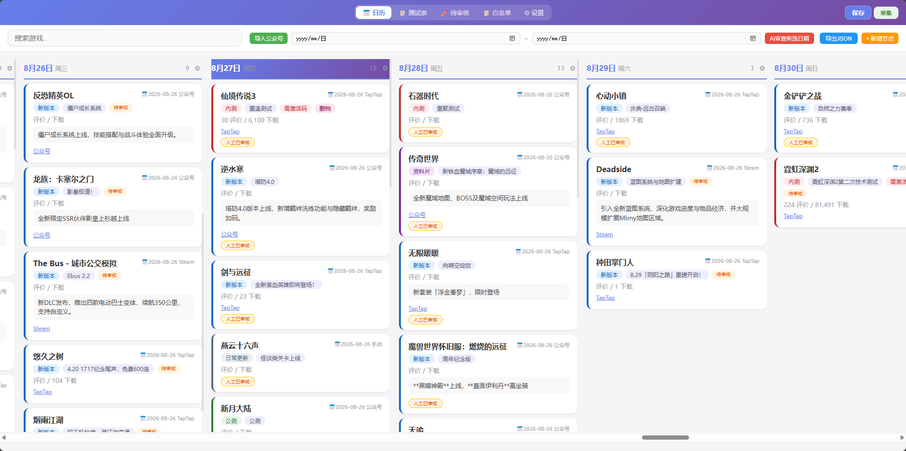
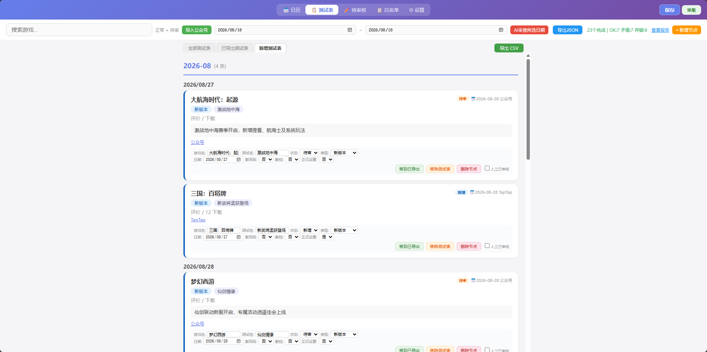
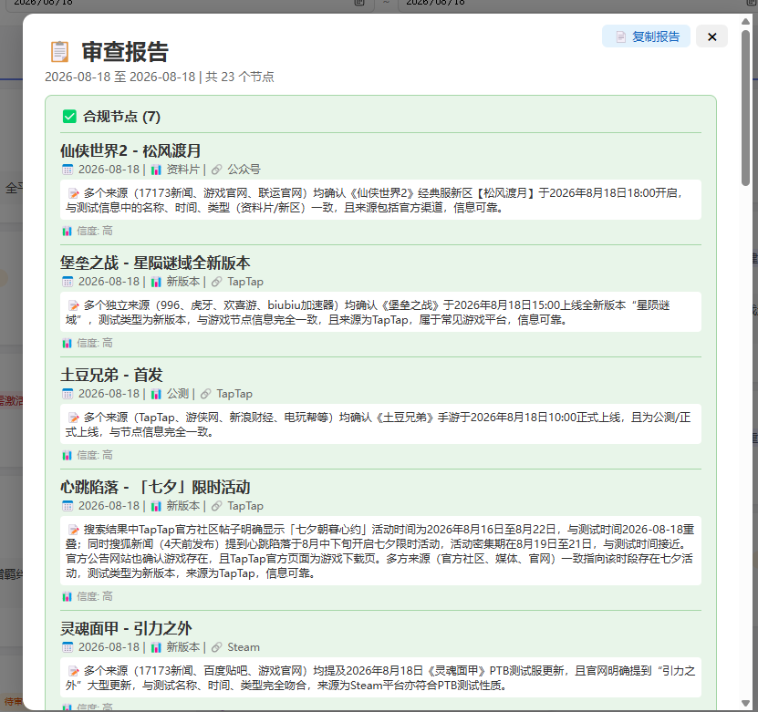
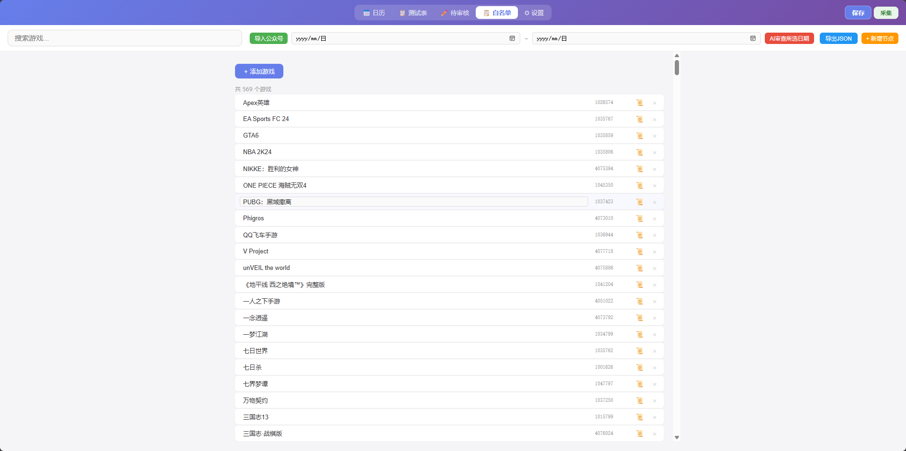
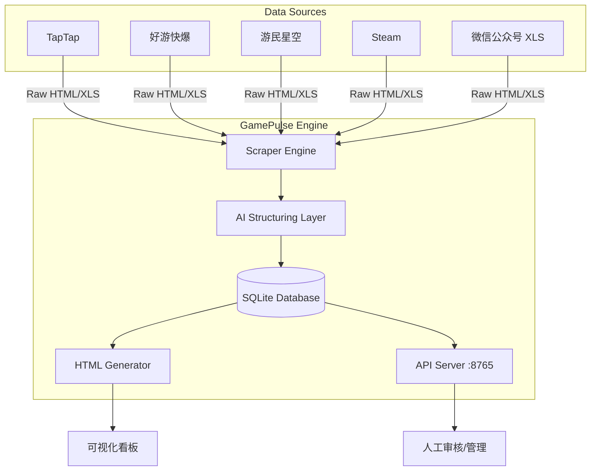

<div align="center">

# 🎮 GamePulse AI

### **多源聚合 · AI 结构化 · 智能可视化游戏数据中台**

[]()
[]()
[]()
[]()

> **GamePulse AI** 是一个基于 **LLM (大语言模型)** 驱动的自动化游戏数据聚合平台。
> 它能够从 **TapTap、好游快爆、游民星空、Steam** 等多个主流平台抓取非结构化数据，
> 利用 **AI 智能提取** 引擎将其转化为结构化情报，并通过 **Web API** 和 **可视化看板** 进行实时监控。

---

</div>

## 📸 Screenshots

<div align="center">

**📅 日历视图 — 按日期纵览游戏排期**



---

**📋 测试排期表 — 按月/周展示白名单游戏节点**



---

**🔍 AI 审查报告 — 自动交叉验证数据准确性**



---

**⚙️ 白名单管理 — 自定义关注游戏列表**



</div>

---

## ✨ 核心技术亮点

- 🔍 **全网数据收割 (Multi-Source Scraping)**
  自动化爬取 TapTap（预约/热门）、好游快爆时间线、游民星空、Steam 新品/热销，支持白名单过滤。

- 🧠 **AI 智能结构化 (Intelligent Extraction)**
  底层接入 DeepSeek / DashScope API，利用 Prompt Engineering 从嘈杂的 HTML 文本中精准提取：测试节点、版本号、激活码要求、删档状态、评价数等关键字段。

- 📊 **多维可视化看板 (Visual Dashboards)**
  自动生成四种视角的 HTML 交互大屏：
  1. 📅 **日历视图**：一眼看清未来排期
  2. 📋 **四栏看板**：按状态（待测/测试中/已上线）流转
  3. 📝 **测试排期表**：按时间轴线性展示
  4. 👁️ **待审核列表**：新抓取数据的人工复核区

- 🌐 **RESTful API 服务 (Headless Management)**
  内置轻量级 Web Server (端口 8765)，支持数据的增删改查 (CRUD)，可对接飞书/微信机器人或前端框架。

- 📦 **开箱即用 (Zero Config)**
  提供打包好的 Windows Executable (.exe)，双击即可运行全流程，无需配置 Python 环境。

---

## 🏗️ 系统架构



---

## 🚀 Quick Start

### **方式 A：双击运行 (推荐)**
下载 `dist/游戏节点数据看板.exe`，双击即刻启动全流程（爬取 -> AI 提取 -> 生成看板）。

### **方式 B：Python 源码运行**
```bash
# 1. 安装依赖
pip install requests beautifulsoup4 lxml rich flask

# 2. 配置环境变量 (可选，用于 AI 功能)
cp .env.example .env
# 编辑 .env 填入你的 API Key

# 3. 启动主程序
python main.py --serve
```

### **方式 C：仅启动 API 服务**
如果 HTML 已生成，只需启动后端接口：
```bash
python main.py --serve 8765
```
访问 `http://127.0.0.1:8765` 即可进入管理后台。

---

## 📂 项目结构

```text
├── main.py                  # 模块化主入口
├── ai_caller.py             # AI 提取核心 (Prompt Engineering)
├── api_server.py            # Flask Web API
├── config_manager.py        # 动态配置加载
├── merger.py                # 智能合并与去重算法
├── public_account.py        # 公众号 XLS 数据清洗
│
├── scraper/                 # 多平台爬虫模块
│   ├── taptap.py
│   ├── haoyou.py
│   └── steam.py
│
├── database/                # 数据持久化层
│   ├── schema.py
│   └── operations.py
│
├── html_generator/          # 前端可视化构建
│   ├── calendar.py
│   └── kanban.py
│
└── dist/                    # 编译后的可执行文件
```

---

## 🛠️ 技术栈

- **后端**: Python 3.10+, Flask (REST API), SQLite
- **前端**: ECharts (可视化), HTML5/CSS3
- **AI**: DeepSeek, DashScope (Qwen), OpenAI-compatible API
- **爬虫**: Requests, BeautifulSoup4, LXML
- **打包**: PyInstaller

---

## 📄 License

Distributed under the **MIT License**. See `LICENSE` for more information.

---

<div align="center">
  <sub>crafted with ❤️ by <b>17173 Data Team</b></sub>
</div>
